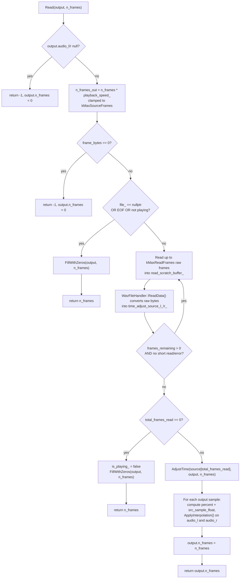
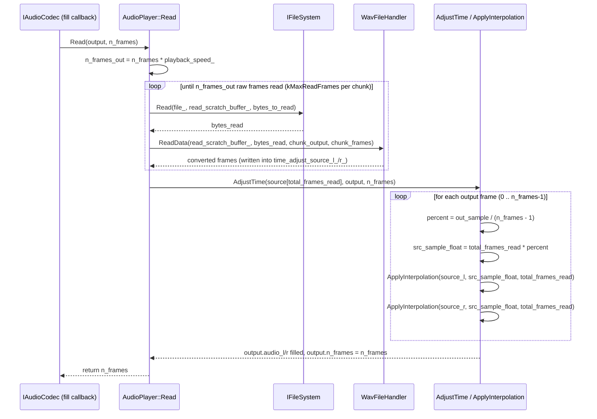

# wav_file_reader

A WAV file player built around a hardware-agnostic app layer (`AudioPlayer`, `FileSystem`,
`FatFsCore`) that talks to hardware only through interfaces (`IAudioCodec`, `IBlockDevice`,
`IFileSystem`). Concrete implementations of those interfaces are swapped per platform, which
lets the same application code build for either:

- the **Raspberry Pi Pico / RP2040** (real hardware), or
- a **native host build** (Linux, incl. WSL) for fast iteration, testing, and debugging
  without any board attached.

See [`FATFS_PICO_PORTING.md`](FATFS_PICO_PORTING.md) for details on the layered architecture.

## Repository layout

```
app/                    Hardware-agnostic application layer
  AudioPlayer/           Audio playback logic (depends only on IAudioCodec + IFileSystem)
  FileSystem/            FatFs <-> IBlockDevice glue + IFileSystem adapter
  include/               IFileSystem interface
hw_interfaces/          Interfaces + concrete hardware implementations
  include/               IAudioCodec, IInputHandler, IStorageController interfaces,
                         CompositeInputHandler (platform-agnostic input aggregator)
  pico_adc/              RP2040 ADC implementation
  i2s_audio_codec/       RP2040 I2S audio codec implementation
  linux/                 Native/Linux stub implementations (PosixBlockDevice, NullAudioCodec,
                         ConsoleInputHandler)
lib/                    Vendored/third-party libraries (FatFsCore, pico_audio_i2s_32b,
                        no-OS-FatFS-SD-SPI-RPi-Pico)
platform/
  rp2040/                Pico/RP2040 build entry point (CMakeLists.txt, pico_sdk_import.cmake,
                         wav_file_reader.cpp)
  linux/                 Native/Linux build entry point (main.cpp)
CMakeLists.txt          Native/Linux build entry point (root of the repo)
```

## Building

There are **two separate build entry points**, one per platform. They cannot be configured in
the same CMake run (the Pico SDK toolchain must be selected before the first `project()` call,
which conflicts with a native host build), so pick the one you need and configure it into its
own build directory.

| Platform                     | Configure from        | Typical build dir |
|-------------------------------|------------------------|--------------------|
| Native host (Linux / WSL)     | repository root (`CMakeLists.txt`) | `build/` |
| Raspberry Pi Pico / RP2040    | `platform/rp2040`      | `build-rp2040/`    |

### Option A — Native build (Linux / WSL)

Builds `wav_file_reader_native`, linking the shared app layer against the `hw_interfaces/linux`
implementations (a file-backed `IBlockDevice` and a no-op `IAudioCodec`). Useful for building
and running on a regular Linux machine or under WSL, without any Pico hardware.

Requirements: CMake >= 3.13, a C/C++ compiler (gcc/g++ or clang), and `make` or `ninja`.

**Third-party dependency:** the native build's console input handling
(`hw_interfaces/linux/user_input/`) depends on
[CLI11](https://github.com/CLIUtils/CLI11) for parsing typed console commands. It is vendored
as a single-header include (`hw_interfaces/linux/user_input/include/CLI11.hpp`), so no separate
install step is required.

```bash
# From the repository root
cmake -S . -B build
cmake --build build

# Run it (creates/uses disk.img in the current directory as the backing FAT volume)
./build/wav_file_reader_native
```

The native build also produces `make_disk_image`, a CLI utility that packs a folder's contents
into a FAT disk-image file, so you can populate `disk.img` with real WAV files (or anything
else) from the host filesystem before running the emulator:

```bash
# Pack ./my_wav_files into disk.img (32 MiB by default; pass a sector count as a 3rd arg for a
# larger image, e.g. `./build/make_disk_image my_wav_files disk.img 262144` for 128 MiB)
./build/make_disk_image my_wav_files disk.img

./build/wav_file_reader_native
```

`make_disk_image` goes through the same `PosixBlockDevice`/`FatFsFileSystemAdapter` stack as
the app itself, so the resulting image is guaranteed to mount correctly. Note: FatFs is built
with long-file-name support disabled (`FF_USE_LFN == 0`, see
`lib/FatFsCore/ff15/source/ffconf.h`), so only 8.3 short filenames are supported — rename any
files/folders with longer names before packing them.

### Option B — Raspberry Pi Pico / RP2040 build

Builds the `wav_file_reader` firmware image (`.uf2`, `.elf`, etc.) using the Pico SDK. This is
the original board target; configure it by pointing CMake at `platform/rp2040` instead of the
repository root.

Requirements: [Pico SDK](https://github.com/raspberrypi/pico-sdk) (set `PICO_SDK_PATH` or let it
fetch from git), the `arm-none-eabi` toolchain, CMake >= 3.13, and `make` or `ninja`.

```bash
# From the repository root
cmake -S platform/rp2040 -B build-rp2040
cmake --build build-rp2040

# Flash build-rp2040/wav_file_reader.uf2 to the Pico (e.g. via BOOTSEL mass-storage mode)
```

`PICO_BOARD` defaults to `pico`; override it with `-DPICO_BOARD=<board>` if targeting a
different board (e.g. `pico2`, `pico_w`).

**Third-party dependency:** the RP2040 build's SD-over-SPI storage backend
(`app/FileSystem/hw_layer/SdInterface/`) is built on top of the SD-over-SPI hardware driver from
[carlk3/no-OS-FatFS-SD-SPI-RPi-Pico](https://github.com/carlk3/no-OS-FatFS-SD-SPI-RPi-Pico),
vendored as a git submodule at `lib/no-OS-FatFS-SD-SPI-RPi-Pico`. Only its low-level driver
(`sd_card.c`, `sd_spi.c`, `spi.c`, `crc.c`) is used — its own bundled FatFs core and diskio glue
are not, since this project has its own (`lib/FatFsCore`, `app/FileSystem/src/diskio.cpp`). Run
`git submodule update --init --recursive` (or clone with `--recurse-submodules`) before
configuring the RP2040 build.

> **Note:** `app/FileSystem/hw_layer/SdInterface/src/hw_config.c` currently configures a
> **placeholder pinout** (copied from the vendored library's documented default wiring), not a
> real hardware SD socket. Replace it with the actual SPI instance/GPIO assignments before
> relying on this on real hardware. See `FATFS_PICO_PORTING.md` for details.

### Input handling

Navigation/parameter input is modeled behind a single, source-agnostic interface,
`IInputHandler` (`hw_interfaces/include/IInputHandler.h`), instead of one interface per physical
input mechanism. This lets `app::ui::UserInterface` react to "navigate up" or "change parameter
X" without ever knowing whether that event came from a button, an ADC, or a console command.

```cpp
enum class InputEventType { kNavigationEvent, kParameterChangeEvent, kSelectEvent };
enum class NavigationDirection { kUp, kDown };

struct InputEvent
{
    InputEventType type;
    union
    {
        NavigationDirection navigationDirection; // valid when type == kNavigationEvent
        ParameterChange parameter;                // valid when type == kParameterChangeEvent
    };
};

class IInputHandler
{
public:
    virtual ~IInputHandler() = default;
    virtual int Init() = 0;
    virtual bool PollEvent(InputEvent &event) = 0; // non-blocking; true if an event was produced
};
```

Each concrete `IInputHandler` implementation owns the translation from its own raw signal (a
GPIO edge, an ADC delta, a parsed console line, ...) into one of these shared `InputEvent`
values — the interface itself never needs to know how many kinds of input sources exist.

### Aggregating multiple sources: `CompositeInputHandler`

A single platform can have more than one physical source feeding the same logical event (e.g.
on RP2040, both a dedicated "up" button *and* an ADC could both produce `kUp`).
`hw_interfaces/include/CompositeInputHandler.h` implements `IInputHandler` itself and holds a
`std::vector<IInputHandler*>` of underlying sources, polling each in registration order and
forwarding the first event found:

```cpp
hw_interface::CompositeInputHandler input_handler;
input_handler.AddSource(&button_up);
input_handler.AddSource(&button_down);
input_handler.AddSource(&adc_navigation);
input_handler.Init();

app::ui::UserInterface ui(input_handler, display); // still just IInputHandler&
```

Because `CompositeInputHandler` *is-a* `IInputHandler`, `UserInterface` (and any other
consumer) is unaffected by how many sources are actually wired up — a platform with a single
source (e.g. native/Linux today) can pass that source directly instead, with no composite
needed.

### How console input parsing works on Linux

The native/Linux build has only one input source today: `ConsoleInputHandler`
(`hw_interfaces/linux/user_input/`), which reads typed commands (`up` / `down`) from stdin.

- **`Init()`** puts stdin into non-blocking mode (`fcntl(..., O_NONBLOCK)`). This must be called
  once before the first `PollEvent()` (done in `platform/linux/main.cpp`) — otherwise a read can
  block waiting for a line that hasn't been typed yet.
- **`PollEvent()`** drains whatever bytes are currently available on stdin via a raw,
  non-blocking `read()` call into an internal buffer, then extracts one `\n`-terminated line at
  a time. Raw `read()` is used instead of `std::cin`/`poll()` deliberately: mixing `poll()` with
  a buffered `std::istream` is unreliable, since the stream can silently over-read several
  lines' worth of bytes into its own internal buffer in a single underlying read, after which
  `poll()` (and `std::cin.rdbuf()->in_avail()`) can both report "nothing available" even though
  a full line is already sitting in the stream's buffer.
- Each complete line is tokenized and handed to a `CLI::App` ([CLI11](https://github.com/CLIUtils/CLI11)),
  which recognizes `up` and `down` as **subcommands** (not flags — CLI11 flags require a `--`
  prefix and reject positional/bare use, e.g. `add_flag("up", ...)` throws
  `CLI::IncorrectConstruction` for a bare `up`). `app_.clear()` is called before each reparse so
  a previous line's parsed state can't leak into the next one. Unrecognized input raises
  `CLI::ParseError`, which is caught and simply ignored (the handler keeps polling).
- If multiple complete lines are already buffered, `PollEvent()` keeps consuming them until one
  produces a recognized event (or the buffer is exhausted) — so one bad/blank line queued ahead
  of a valid command can't stall recognition of that command.

### How to extend

**Adding a new input event type** (e.g. a `kSelectEvent` payload, or a new navigation
direction):

1. Add the new variant to `InputEventType` (or a new field in the `InputEvent` union) in
   `hw_interfaces/include/IInputHandler.h`. Keep the union minimal — only add a new member if
   the event genuinely carries different data than what's already there.
2. Update every `IInputHandler` implementation that should be able to produce it, and every
   consumer (`app::ui::UserInterface::ProcessUi()`) that should react to it. Because
   `InputEvent`/`IInputHandler` are shared across all platforms, this is the *only* place event
   semantics are defined — no platform-specific branching should be needed here.

**Adding a new concrete input source** (e.g. a physical button, an ADC-based navigation
source, or another console command):

1. Create a new class implementing `IInputHandler` (`Init()` + `PollEvent()`), in the
   appropriate platform folder — e.g. a `ButtonInputHandler` would live in
   `hw_interfaces/rp2040/` (mirroring `hw_interfaces/linux/user_input/`'s
   `ConsoleInputHandler`), with its own `include/`/`src/`/`CMakeLists.txt`.
2. In `PollEvent()`, translate whatever raw signal that source owns (a GPIO edge, an ADC
   threshold crossing, a newly parsed console token, ...) into an `InputEvent` using the shared
   vocabulary from step 1 above — the rest of the system (`CompositeInputHandler`,
   `UserInterface`) never needs to know this translation happened.
3. Wire it up in the platform's entry point (`platform/rp2040/wav_file_reader.cpp` or
   `platform/linux/main.cpp`):
   - If it's the only source on that platform, pass it directly to `UserInterface` as
     `IInputHandler&` (as done today for `ConsoleInputHandler` on Linux).
   - If it's one of several sources, register it with a `CompositeInputHandler` via
     `AddSource(&new_source)` instead, and pass the composite to `UserInterface`.
4. Remember to call the new handler's (or the composite's) `Init()` before the main polling loop
   starts — e.g. `ConsoleInputHandler::Init()` must run before `PollEvent()` or console reads can
   block (see `platform/linux/main.cpp`).

## Resampling logic

`AudioPlayer::Read()` (`app/AudioPlayer/src/AudioPlayer.cpp`) is the only place
`SetPlaybackSpeed()` actually takes effect. Rather than reading more/fewer raw frames directly
into the caller-supplied output buffer — which would overflow it when speed > 1.0, or leave it
partially stale when speed < 1.0 — `Read()` always produces exactly `n_frames` output frames:

1. **Compute how many raw source frames are needed.** `n_frames_out = n_frames *
   playback_speed_` (frames at the file's native sample rate), clamped to the fixed-size
   pre-resample scratch buffers' capacity (`kMaxSourceFrames`) as a last-resort safety net.
2. **Stream + convert those raw frames into scratch buffers.** Raw bytes are read from the open
   WAV file in bounded chunks (`kMaxReadFrames` at a time) and converted by
   `WavFileHandler::ReadData()` straight into `time_adjust_source_l_`/`time_adjust_source_r_` —
   the output buffer isn't touched yet.
3. **Resample once, in one shot.** `AdjustTime()` is called with the actual number of source
   frames that were read (`total_frames_read`, which can be less than `n_frames_out` on a short
   read/EOF) and the target output count (`n_frames`). For every output frame, it maps that
   frame to a fractional position within the source range and calls `ApplyInterpolation()`
   (linear interpolation between two adjacent source samples) once per channel, writing directly
   into `output.audio_l`/`output.audio_r`.

If no source data could be read at all (e.g. EOF hit immediately, or nothing is currently
playing), `Read()` skips straight to filling `output` with silence via `FillWithZeros()`.

### Flowchart



### Sequence diagram



## Choosing which one to use

- Use the **native build** while developing/testing app-layer logic (`AudioPlayer`,
  `FileSystem`, FatFs glue) — it's fast to iterate on and doesn't require hardware.
- Use the **RP2040 build** to produce the actual firmware that runs on the Pico.

Because both targets build the same `app/` and `lib/FatFsCore` sources unmodified — only the
`hw_interfaces/*` implementation and the platform entry point differ — behavior verified on the
native build should carry over directly to the RP2040 build.
