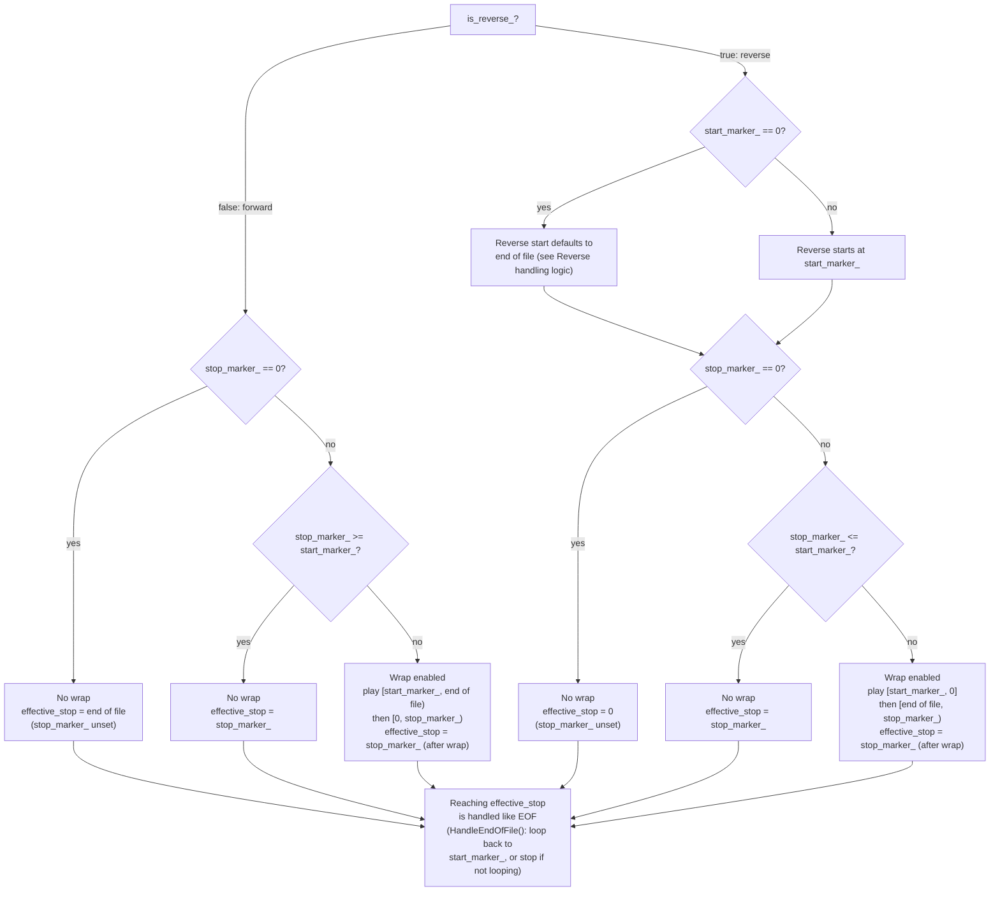
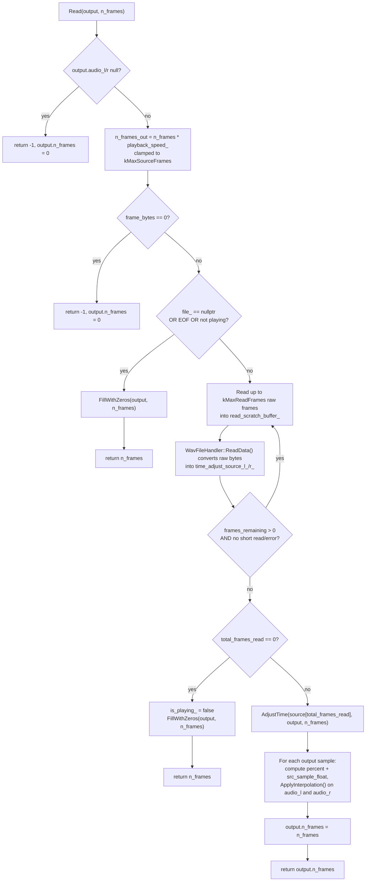
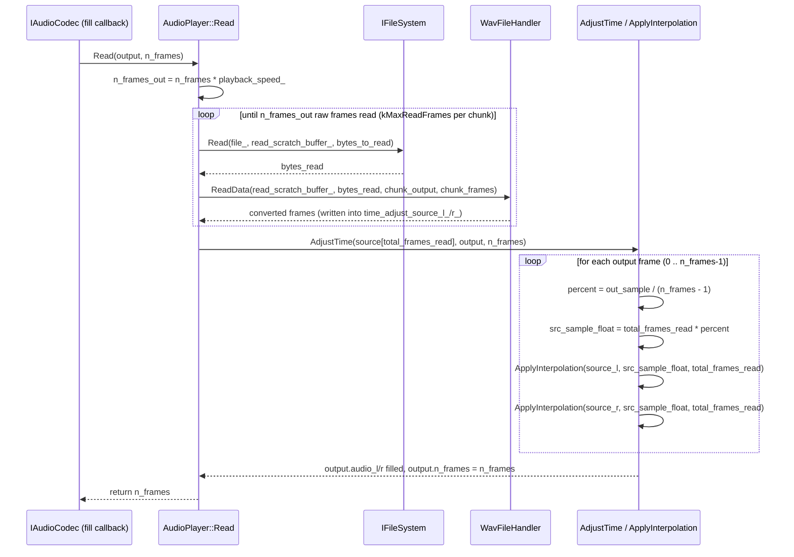

# AudioPlayer

`AudioPlayer` (`app/AudioPlayer/src/AudioPlayer.cpp` / `include/AudioPlayer.h`) streams a WAV
file's data chunk into fixed-size output buffers on demand (`Read()`), independent of any
platform's audio codec (see the repository root `README.md` for how it's wired up). This document
covers three things that are easy to get wrong when touching this file: marker/wrap-around logic,
reverse playback, and the resampling logic used to implement variable playback speed.

## Marker logic

`start_marker_` and `stop_marker_` are frame indices into the file's data chunk (set via
`SetStartMarker(relative_position)`/`SetStopMarker(relative_position)`, which convert a
`[0.0, 1.0]` fraction of the file's total length to frames using `GetTotalFrames()` — see
`SetMarker()`). They bound the region of the file that gets
played, and their *relative order* (combined with `is_reverse_`) decides whether playback plays
a single contiguous range or wraps around a file boundary.

### Defaults / "unset" sentinel

- `start_marker_` defaults to `0`.
- `stop_marker_` defaults to `0`, which always means **"no stop marker set"** — forward playback
  falls back to the true end of the file; reverse playback falls back to frame `0`.
- `start_marker_ == 0` also has a special meaning, but only for reverse playback (see
  [Reverse handling logic](#reverse-handling-logic) below): it means "start at the true end of the
  file" rather than "start at frame 0".

### Forward playback (`is_reverse_ == false`)

- **No wrap** (`stop_marker_ == 0`, or `stop_marker_ >= start_marker_`): play
  `[start_marker_, effective_stop)`, where `effective_stop` is `stop_marker_` if set, otherwise the
  true end of file. Reaching `effective_stop` is handled exactly like end-of-file (see
  `HandleEndOfFile()`).
- **Wrap** (`0 < stop_marker_ < start_marker_`): the playable range wraps past the end of the
  file. Playback goes `[start_marker_, end of file)` then `[0, stop_marker_)`. The region
  `[stop_marker_, start_marker_)` is **never played** — this is by design, not a bug.

  Example (10 frames, `start_marker_ = 8`, `stop_marker_ = 2`): first read after the marker seek
  reads frames 8–9, wraps, then continues reading 0–1 — 4 frames with no gap in the output. Once
  `current_frame_index_` reaches `stop_marker_` (2), that's handled like EOF: with looping
  enabled, playback jumps back to `start_marker_` and the same cycle repeats — reads 8–9, wraps,
  reads 0–1, reaches `stop_marker_` again, and so on indefinitely.

### Reverse playback (`is_reverse_ == true`)

- **No wrap** (`stop_marker_ == 0`, or `stop_marker_ <= start_marker_`): play backward from
  `start_marker_` down to `effective_stop`, where `effective_stop` is `stop_marker_` if set,
  otherwise frame `0`. Reaching `effective_stop` is handled like end-of-file.
- **Wrap** (`stop_marker_ > start_marker_`): the playable range wraps past the start of the file.
  Playback goes `[start_marker_, 0]` backward, then wraps to the true end of file and continues
  backward down to `stop_marker_`. The region `(start_marker_, stop_marker_]` is never played —
  the mirror image of the forward wrap case.

  Example (10 frames, `start_marker_ = 2`, `stop_marker_ = 8`): first read after the marker seek
  reads frames 2, 1, 0 (down to frame 0), wraps to the end of file, then reads 9, 8 down to
  `stop_marker_` (8). Once `current_frame_index_` reaches `stop_marker_`, that's handled like
  EOF: with looping enabled, playback jumps back to `start_marker_` and the cycle repeats.

### Decision tree

How `is_reverse_`/`start_marker_`/`stop_marker_` combine to pick the playable range
(`effective_stop`, computed in `SeekStartChunk()`) and whether wraparound is enabled
(`IsWrapEnabled()`):

### Implementation

- `IsWrapEnabled()` decides which of the two cases above applies, based on `is_reverse_` and the
  relative order of `start_marker_`/`stop_marker_`.
- `WrapMarker()` (called once per `Read()`, right after `TrackCurrentFrameIndex()` has updated
  `current_frame_index_` for the frames just read) detects that the far boundary was reached
  (physical end of file when forward, frame `0` when reverse), and — if wraparound is enabled and
  hasn't already happened this playthrough (`has_wrapped_`) — resets `current_frame_index_` to the
  opposite boundary and re-syncs `file_read_index_`/the physical file cursor.
- `SeekStartChunk()` computes `frames_remaining_` (how many raw frames can be read before hitting
  the relevant marker/EOF bound) separately for the forward and reverse branches, always
  explicitly `Lseek()`-ing the file to `current_frame_index_`'s byte offset first — this is
  required because marker seeks (`SeekStartMarker()`) and wraps (`WrapMarker()`) only update
  `AudioPlayer`'s own bookkeeping, never the underlying file's read position directly.
- `Read()` calls `SeekStartChunk()`/`FetchData()`/`TrackCurrentFrameIndex()` once, checks
  `WrapMarker()`, and if it wrapped, repeats the same three calls a second time — appending into
  the same output buffer via `FetchData(buffer_offset)` — so a single wrap is invisible to the
  caller (no audible gap or extra `Read()` call needed).

## Reverse handling logic

### `current_frame_index_` is direction-asymmetric

`current_frame_index_` means different things depending on `is_reverse_`:

- **Forward:** the next frame that will be read.
- **Reverse:** one past the last frame that was played (the next chunk read is the
  `frames_remaining_` frames immediately *before* it).

This asymmetry is why `SeekStartMarker()` seeds `current_frame_index_ = clamped_start_marker + 1`
for reverse but `= clamped_start_marker` for forward, and why `TrackCurrentFrameIndex()`
subtracts for reverse but adds for forward. **Don't expose this field directly to a UI** — use
`GetPlayheadFrame()`/`GetPlayheadMs()` instead, which normalize both directions into "the frame
currently at the playhead".

### Enabling/disabling reverse (`SetReverse()`)

`SetReverse(enable)` only re-seeds `current_frame_index_` (via `SeekStartMarker()`) when playback
is currently sitting at frame `0` and reverse is being newly enabled
(`enable && !is_reverse_ && current_frame_index_ == 0`) — e.g. right after `LoadFile()`, before
any `Read()` has advanced the index. Toggling reverse mid-playback otherwise leaves
`current_frame_index_` untouched, so playback simply changes direction from wherever it currently
is.

`is_reverse_` must be assigned *before* calling `SeekStartMarker()` in this path, since
`SeekStartMarker()` reads `is_reverse_` to decide how to seed `current_frame_index_`.

### Reverse with an unset start marker

If `start_marker_` is still `0` (never explicitly set) when reverse is engaged,
`SeekStartMarker()` seeds `current_frame_index_` from the **true end of the file** instead of from
frame `0` — mirroring how an unset `stop_marker_` means "play to true end" in forward mode. Without
this fallback, reverse would have only a single playable frame (`start_marker_ + 1` down to `0`)
by default, which surfaces as near-instant looping/silence.

## Resampling logic

`AudioPlayer::Read()` is the only place `SetPlaybackSpeed()` actually takes effect. Rather than
reading more/fewer raw frames directly into the caller-supplied output buffer — which would
overflow it when speed > 1.0, or leave it partially stale when speed < 1.0 — `Read()` always
produces exactly `n_frames` output frames:

1. **Compute how many raw source frames are needed.** `n_frames_out = n_frames *
   playback_speed_` (frames at the file's native sample rate), clamped to the fixed-size
   pre-resample scratch buffers' capacity (`kMaxSourceFrames`) as a last-resort safety net.
2. **Stream + convert those raw frames into scratch buffers.** Raw bytes are read from the open
   WAV file in bounded chunks (`kMaxReadFrames` at a time) and converted by
   `WavFileHandler::ReadData()` straight into `time_adjust_source_l_`/`time_adjust_source_r_` —
   the output buffer isn't touched yet.
3. **Resample once, in one shot.** `AdjustTime()` is called with the actual number of source
   frames that were read (`total_frames_read`, which can be less than `n_frames_out` on a short
   read/EOF) and the target output count (`n_frames`). For every output frame, it maps that
   frame to a fractional position within the source range and calls `ApplyInterpolation()`
   (linear interpolation between two adjacent source samples) once per channel, writing directly
   into `output.audio_l`/`output.audio_r`.

If no source data could be read at all (e.g. EOF hit immediately, or nothing is currently
playing), `Read()` skips straight to filling `output` with silence via `FillWithZeros()`.

### Flowchart

### Sequence diagram

